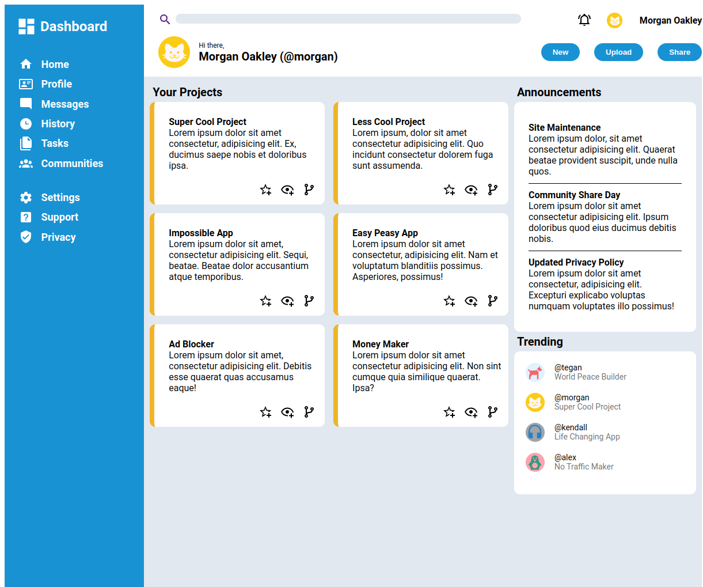

# Admin Dashboard
Admin Dashboard: a project for TheOdinProject's Intermediate HTML and CSS Course. This layout was recreated in HTML and CSS,from a reference image.

**Link to project:** https://www.andyglover.io/odin-project-admin-dashboard/

## How It's Made:

**Tech used:** HTML, CSS

CSS Grid was my go to on this project. It took a lot of time to get each element into place, but once I got the hang of it, it really started to come together, which was so satisfying!

## Optimizations

I'd love to add some interactivity and hover effects to bring this dashboard to life!

## Lessons Learned:

Constructing a complex layout with CSS Grid is a great skill to have in my toolbelt and this project really gave me a good grasp of it!

## Examples:
Here's a few more repositories of mine you might like to check out:

**Calculator:** https://github.com/andyglover/odin-calculator

**GIF Thingy:** https://github.com/andyglover/gif-thingy

**Library:** https://github.com/andyglover/odin-project-library

**Rock Paper Scissors:** https://github.com/andyglover/odin-rock-paper-scissors

**Tic-Tac-Toe:** https://github.com/andyglover/odin-project-tictactoe